# Database Schema Documentation
## Recruitment Management System

**Version:** 1.0  
**Database:** PostgreSQL  
**ORM:** Prisma 5.22.0  
**Last Updated:** October 28, 2025

---

## Table of Contents

1. [Overview](#overview)
2. [Entity Relationship Diagram](#entity-relationship-diagram)
3. [Database Modules](#database-modules)
4. [Table Definitions](#table-definitions)
5. [Enums](#enums)
6. [Indexes](#indexes)
7. [Constraints](#constraints)

---

## Overview

This Recruitment Management System database is designed to handle end-to-end recruitment processes including:

- **User Management**: User profiles, education, skills, and custom fields
- **Job Management**: Job postings, applications, and bookmarking
- **CV/Resume Management**: Document storage and management
- **Recruitment Process**: Interviews, appointments, and testing
- **Gallery**: Image and media management

### Key Statistics
- **Total Tables**: 28
- **Total Enums**: 3
- **Total Relations**: 50+

---

## Entity Relationship Diagram

### Mermaid ER Diagram

```mermaid
erDiagram
    %% User Management Module
    User ||--o{ UserEducation : "has"
    User ||--o{ UserSkills : "has"
    User ||--o{ UserInfoData : "has"
    User ||--o{ CvManagerCv : "uploads"
    User ||--o{ GalleryCv : "uploads"
    User ||--o{ JobsApplied : "applies"
    User ||--o{ JobsBookmark : "bookmarks"
    User ||--o{ BrAppointment : "receives"
    User ||--o{ ScreeningInterview : "attends"
    User ||--o{ FocusGroupInterview : "attends"
    User ||--o{ FinalInterview : "attends"
    User ||--o{ LetterOfIntent : "receives"
    User ||--o{ UtTest : "takes"
    User ||--o{ Job : "creates"
    User ||--o{ Job : "updates"

    UserEducation }o--|| UserEducationLevel : "references"
    UserEducation }o--o| Institute : "references"
    
    UserInfoData }o--|| UserInfoField : "references"
    UserInfoField }o--|| UserInfoCategory : "belongs_to"

    %% Jobs Module
    Job ||--o{ JobSkill : "requires"
    Job ||--o{ JobsApplied : "receives"
    Job ||--o{ JobsBookmark : "has"
    Job ||--o{ UtTest : "includes"
    Job }o--o| UserEducationLevel : "requires_min_education"

    JobsApplied }o--|| CvManagerCv : "uses"

    %% CV Manager Module
    CvManager ||--o{ CvManagerImageMeta : "contains"

    %% Gallery Module
    Gallery ||--o{ GalleryImageMeta : "contains"

    %% Entity Definitions
    User {
        BigInt id PK
        String auth
        String username UK
        String password
        String firstname
        String lastname
        String email UK
        String phone1
        String phone2
        String institution
        String department
        String address
        String city
        String country
        String lang
        String theme
        String timezone
        BigInt firstAccess
        BigInt lastAccess
        BigInt lastLogin
        BigInt currentLogin
        BigInt deletedAt
        Boolean suspended
        BigInt createdAt
        BigInt updatedAt
    }

    UserEducation {
        BigInt id PK
        BigInt userId FK
        BigInt educationLevelId FK
        String degreeTitle
        String institute
        BigInt instituteId FK
        String majorSubject
        String grade
        String passingYear
        String country
        BigInt createdAt
        BigInt updatedAt
    }

    UserEducationLevel {
        BigInt id PK
        String name
    }

    UserSkills {
        BigInt id PK
        BigInt userId FK
        String skillName
        Int level
        BigInt createdAt
        BigInt updatedAt
    }

    UserInfoCategory {
        BigInt id PK
        String name
        Int sortOrder
    }

    UserInfoField {
        BigInt id PK
        String name
        String shortname
        String datatype
        String description
        BigInt categoryId FK
        Int sortOrder
        Boolean required
        Boolean visible
    }

    UserInfoData {
        BigInt id PK
        BigInt userId FK
        BigInt fieldId FK
        String data
        Int dataFormat
        BigInt createdAt
        BigInt updatedAt
    }

    Job {
        BigInt id PK
        String title
        String description
        String company
        DateTime postFrom
        DateTime postTo
        Boolean status
        String industry
        String city
        String country
        EmploymentType employmentType
        String employmentShift
        BigInt minimumEducationId FK
        String minimumExperience
        String certification
        String minimumSalary
        BigInt createdBy FK
        BigInt updatedBy FK
        BigInt createdAt
        BigInt updatedAt
        BigInt deletedAt
    }

    JobSkill {
        BigInt id PK
        BigInt jobId FK
        String skillName
    }

    JobsApplied {
        BigInt id PK
        BigInt jobId FK
        BigInt userId FK
        BigInt cvId FK
        ApplicationStatus status
        BigInt appliedAt
        BigInt statusUpdatedAt
        String note
    }

    JobsBookmark {
        BigInt id PK
        BigInt jobId FK
        BigInt userId FK
        Boolean status
        BigInt createdAt
        BigInt updatedAt
    }

    CvManager {
        BigInt id PK
        String name
        Boolean comments
        Boolean isPublic
        String intro
        BigInt createdAt
        BigInt updatedAt
    }

    CvManagerCv {
        BigInt id PK
        String filepath
        String filename
        BigInt userId FK
        String status
        BigInt deletedAt
        BigInt createdAt
        BigInt updatedAt
    }

    CvManagerImageMeta {
        BigInt id PK
        BigInt cvmanagerId FK
        String image
        String metatype
        String description
    }

    Gallery {
        BigInt id PK
        String name
        Boolean comments
        Boolean isPublic
        String intro
        BigInt createdAt
        BigInt updatedAt
    }

    GalleryCv {
        BigInt id PK
        String filepath
        String filename
        BigInt userId FK
        String status
        BigInt deletedAt
        BigInt createdAt
        BigInt updatedAt
    }

    GalleryImageMeta {
        BigInt id PK
        BigInt galleryId FK
        String image
        String metatype
        String description
    }

    BrAppointment {
        BigInt id PK
        BigInt userId FK
        BigInt batchId
        String designation
        String grade
        BigInt dateOfJoining
        String basicSalary
        String medicalAllowance
        String probationPeriod
        BigInt createdAt
        BigInt updatedAt
    }

    ScreeningInterview {
        BigInt id PK
        BigInt userId FK
        BigInt batchId
        Boolean status
        String comments
        String recommendation
        InterviewPriority priority
        BigInt createdAt
        BigInt updatedAt
    }

    FocusGroupInterview {
        BigInt id PK
        BigInt userId FK
        BigInt batchId
        Boolean status
        String assessorName
        BigInt createdAt
        BigInt updatedAt
    }

    FinalInterview {
        BigInt id PK
        BigInt userId FK
        BigInt batchId
        Int cmp1
        Int cmp2
        Int cmp3
        Int cmp4
        Int cmp5
        String comments
        InterviewPriority priority
        BigInt createdAt
        BigInt updatedAt
    }

    LetterOfIntent {
        BigInt id PK
        BigInt userId FK
        BigInt batchId
        String grade
        BigInt joiningDate
        String basicSalary
        String agreementAmount
        String servingPeriod
        BigInt createdAt
        BigInt updatedAt
    }

    UtTest {
        BigInt id PK
        BigInt jobId FK
        BigInt userId FK
        String score
        Int outOfScore
        Boolean status
        BigInt startDate
        BigInt endDate
        BigInt createdBy FK
        BigInt updatedBy FK
        BigInt createdAt
        BigInt updatedAt
    }

    Institute {
        BigInt id PK
        String name
        Boolean visible
        BigInt deletedAt
    }
```



---

## Database Modules

### 1. User Management Module

**Tables:**
- `user` - Core user information
- `user_education` - User educational qualifications
- `user_education_level` - Education level reference (Master's, Bachelor's, etc.)
- `user_skills` - User skills and proficiency levels
- `user_info_category` - Custom field categories
- `user_info_field` - Custom field definitions
- `user_info_data` - Custom field values for users

**Purpose:** Manages user profiles, authentication, and detailed user information including education and skills.

---

### 2. Jobs & Applications Module

**Tables:**
- `jobs` - Job postings
- `job_skills` - Required skills for jobs
- `jobs_applied` - Job applications
- `jobs_bookmark` - Saved/bookmarked jobs

**Purpose:** Handles job posting creation, management, and application tracking.

---

### 3. CV/Resume Management Module

**Tables:**
- `cv_manager` - CV gallery/collection
- `cvmanager_cv` - Uploaded CV documents
- `cvmanager_image_meta` - Associated images/metadata
- `gallery` - General gallery
- `gallery_cv` - Gallery CV documents
- `gallery_image_meta` - Gallery images/metadata

**Purpose:** Stores and manages user resumes and associated documents.

---

### 4. Recruitment Process Module

**Tables:**
- `screening_interview` - Initial screening results
- `focus_group_interview` - Group interview assessments
- `final_interview` - Final interview evaluations
- `letter_of_intent` - Employment offer letters
- `br_appointment` - Final appointment/hiring details
- `ut_test` - Skills/aptitude tests

**Purpose:** Tracks candidates through the complete recruitment pipeline.

---

### 5. Supporting Tables

**Tables:**
- `institute` - Educational institutions reference

**Purpose:** Provides reference data for other modules.

---

## Table Definitions

### User Table (`user`)

**Description:** Core user table storing authentication and profile information.

| Column | Type | Constraints | Description |
|--------|------|------------|-------------|
| id | BigInt | PK, Auto | Unique user identifier |
| auth | String(20) | NOT NULL | Authentication/role type |
| username | String(100) | UNIQUE, NOT NULL | Username for login |
| password | String(255) | NOT NULL | Hashed password |
| firstname | String(100) | NOT NULL | User's first name |
| lastname | String(100) | NOT NULL | User's last name |
| email | String(100) | UNIQUE, NOT NULL | Email address |
| phone1 | String(20) | NULLABLE | Primary phone number |
| phone2 | String(20) | NULLABLE | Secondary phone number |
| institution | String(255) | NULLABLE | Associated institution |
| department | String(255) | NULLABLE | Department/division |
| address | String(255) | NULLABLE | Street address |
| city | String(120) | NULLABLE | City |
| country | String(2) | NULLABLE | Country code (ISO 2) |
| lang | String(30) | NULLABLE | Preferred language |
| theme | String(50) | NULLABLE | UI theme preference |
| timezone | String(100) | NULLABLE | User timezone |
| first_access | BigInt | NULLABLE | First access timestamp (Unix) |
| last_access | BigInt | NULLABLE | Last access timestamp (Unix) |
| last_login | BigInt | NULLABLE | Previous login timestamp |
| current_login | BigInt | NULLABLE | Current login timestamp |
| deleted_at | BigInt | NULLABLE | Soft delete timestamp |
| suspended | Boolean | DEFAULT false | Account suspension status |
| created_at | BigInt | NOT NULL | Creation timestamp |
| updated_at | BigInt | NOT NULL | Last update timestamp |

**Relations:**
- Has many: UserEducation, UserSkills, UserInfoData, CvManagerCv, GalleryCv, JobsApplied, JobsBookmark, BrAppointment, Interviews, UtTest
- Creates many: Job (as creator)
- Updates many: Job (as updater)

---

### UserEducation Table (`user_education`)

**Description:** Stores user educational qualifications.

| Column | Type | Constraints | Description |
|--------|------|------------|-------------|
| id | BigInt | PK, Auto | Unique identifier |
| user_id | BigInt | FK, NOT NULL | Reference to user |
| education_level_id | BigInt | FK, NOT NULL | Education level reference |
| degreeTitle | String(255) | NOT NULL | Degree/certificate title |
| institute | String(255) | NULLABLE | Institute name (text) |
| institute_id | BigInt | FK, NULLABLE | Institute reference |
| majorSubject | String(255) | NULLABLE | Major/specialization |
| grade | String(50) | NULLABLE | Grade/CGPA/percentage |
| passingYear | String(50) | NULLABLE | Year of completion |
| country | String(50) | NULLABLE | Country of institution |
| created_at | BigInt | NOT NULL | Creation timestamp |
| updated_at | BigInt | NOT NULL | Last update timestamp |

**Relations:**
- Belongs to: User, UserEducationLevel, Institute (optional)

**Indexes:**
- user_id
- education_level_id
- institute_id

---

### Job Table (`jobs`)

**Description:** Job postings and requirements.

| Column | Type | Constraints | Description |
|--------|------|------------|-------------|
| id | BigInt | PK, Auto | Unique identifier |
| title | String(255) | NOT NULL | Job title |
| description | Text | NULLABLE | Job description |
| company | String(255) | NOT NULL | Company name |
| post_from | Date | NOT NULL | Posting start date |
| post_to | Date | NOT NULL | Posting end date |
| status | Boolean | DEFAULT true | Active status |
| industry | String(255) | NULLABLE | Industry sector |
| city | String(255) | NULLABLE | Job location city |
| country | String(50) | NULLABLE | Job location country |
| employment_type | Enum | NOT NULL | Permanent/PartTime/Contract |
| employment_shift | String(50) | NULLABLE | Work shift details |
| minimum_education_id | BigInt | FK, NULLABLE | Minimum education requirement |
| minimum_experience | String(255) | NULLABLE | Experience requirement |
| certification | Text | NULLABLE | Required certifications |
| minimum_salary | String(50) | NULLABLE | Salary information |
| created_by | BigInt | FK, NOT NULL | Creator user ID |
| updated_by | BigInt | FK, NULLABLE | Last updater user ID |
| created_at | BigInt | NOT NULL | Creation timestamp |
| updated_at | BigInt | NOT NULL | Last update timestamp |
| deleted_at | BigInt | NULLABLE | Soft delete timestamp |

**Relations:**
- Belongs to: User (creator), User (updater), UserEducationLevel
- Has many: JobSkill, JobsApplied, JobsBookmark, UtTest

**Indexes:**
- created_by
- updated_by
- minimum_education_id
- status
- deleted_at

---

### JobsApplied Table (`jobs_applied`)

**Description:** Job application tracking.

| Column | Type | Constraints | Description |
|--------|------|------------|-------------|
| id | BigInt | PK, Auto | Unique identifier |
| job_id | BigInt | FK, NOT NULL | Reference to job |
| user_id | BigInt | FK, NOT NULL | Reference to applicant |
| cv_id | BigInt | FK, NOT NULL | CV used for application |
| status | Enum | DEFAULT SUBMITTED | Application status |
| applied_at | BigInt | NOT NULL | Application timestamp |
| status_updated_at | BigInt | NULLABLE | Status change timestamp |
| note | Text | NULLABLE | Internal notes |

**Relations:**
- Belongs to: Job, User, CvManagerCv

**Unique Constraints:**
- (job_id, user_id) - One application per user per job

**Indexes:**
- job_id
- user_id
- cv_id

---

### UtTest Table (`ut_test`)

**Description:** Skills and aptitude tests for candidates.

| Column | Type | Constraints | Description |
|--------|------|------------|-------------|
| id | BigInt | PK, Auto | Unique identifier |
| job_id | BigInt | FK, NOT NULL | Associated job |
| user_id | BigInt | FK, NOT NULL | Test taker |
| score | String(50) | NULLABLE | Achieved score |
| out_of_score | Int | NOT NULL | Maximum possible score |
| status | Boolean | DEFAULT false | Completion status |
| start_date | BigInt | NOT NULL | Test start timestamp |
| end_date | BigInt | NOT NULL | Test end timestamp |
| created_by | BigInt | FK, NOT NULL | Test creator |
| updated_by | BigInt | FK, NULLABLE | Last updater |
| created_at | BigInt | NOT NULL | Creation timestamp |
| updated_at | BigInt | NOT NULL | Last update timestamp |

**Relations:**
- Belongs to: Job, User (test taker), User (creator), User (updater)

**Indexes:**
- job_id
- user_id
- created_by
- updated_by

---

### ScreeningInterview Table (`screening_interview`)

**Description:** Initial screening interview results.

| Column | Type | Constraints | Description |
|--------|------|------------|-------------|
| id | BigInt | PK, Auto | Unique identifier |
| user_id | BigInt | FK, NOT NULL | Candidate reference |
| batch_id | BigInt | NOT NULL | Recruitment batch |
| status | Boolean | DEFAULT false | Pass/fail status |
| comments | String(255) | NULLABLE | Interview comments |
| recommendation | String(255) | NULLABLE | Interviewer recommendation |
| priority | Enum | NOT NULL | High/Low priority |
| created_at | BigInt | NOT NULL | Creation timestamp |
| updated_at | BigInt | NOT NULL | Last update timestamp |

**Relations:**
- Belongs to: User

**Indexes:**
- user_id
- batch_id

---

### FinalInterview Table (`final_interview`)

**Description:** Final interview evaluation with competency scores.

| Column | Type | Constraints | Description |
|--------|------|------------|-------------|
| id | BigInt | PK, Auto | Unique identifier |
| user_id | BigInt | FK, NOT NULL | Candidate reference |
| batch_id | BigInt | NOT NULL | Recruitment batch |
| cmp1 | Int | NULLABLE | Competency score 1 |
| cmp2 | Int | NULLABLE | Competency score 2 |
| cmp3 | Int | NULLABLE | Competency score 3 |
| cmp4 | Int | NULLABLE | Competency score 4 |
| cmp5 | Int | NULLABLE | Competency score 5 |
| comments | Text | NULLABLE | Interview comments |
| priority | Enum | NOT NULL | High/Low priority |
| created_at | BigInt | NOT NULL | Creation timestamp |
| updated_at | BigInt | NOT NULL | Last update timestamp |

**Relations:**
- Belongs to: User

**Indexes:**
- user_id
- batch_id

---

### BrAppointment Table (`br_appointment`)

**Description:** Final appointment/hiring details.

| Column | Type | Constraints | Description |
|--------|------|------------|-------------|
| id | BigInt | PK, Auto | Unique identifier |
| user_id | BigInt | FK, NOT NULL | Hired employee |
| batch_id | BigInt | NOT NULL | Recruitment batch |
| designation | String(255) | NOT NULL | Job designation |
| grade | String(255) | NOT NULL | Employment grade |
| date_of_joining | BigInt | NOT NULL | Joining date timestamp |
| basic_salary | String(50) | NOT NULL | Base salary |
| medical_allowance | String(50) | NOT NULL | Medical benefits |
| probation_period | String(50) | NOT NULL | Probation duration |
| created_at | BigInt | NOT NULL | Creation timestamp |
| updated_at | BigInt | NOT NULL | Last update timestamp |

**Relations:**
- Belongs to: User

**Indexes:**
- user_id
- batch_id

---

## Enums

### EmploymentType

**Values:**
- `Permanent` - Full-time permanent position
- `PartTime` - Part-time position
- `Contract` - Contract-based employment

**Used in:**
- Job.employment_type

---

### ApplicationStatus

**Values:**
- `Applied` - Application submitted
- `Bookmarked` - Job bookmarked by user
- `Removed` - Application withdrawn/removed
- `SUBMITTED` - Default submitted status

**Used in:**
- JobsApplied.status

---

### InterviewPriority

**Values:**
- `High` - High priority candidate
- `Low` - Low priority candidate

**Used in:**
- ScreeningInterview.priority
- FinalInterview.priority

---

## Indexes

### Performance Indexes

The following indexes are implemented for query optimization:

**User Module:**
- `user_education`: (user_id, education_level_id, institute_id)
- `user_skills`: (user_id)
- `user_info_field`: (category_id)
- `user_info_data`: (user_id, field_id)

**Jobs Module:**
- `jobs`: (created_by, updated_by, minimum_education_id, status, deleted_at)
- `job_skills`: (job_id)
- `jobs_applied`: (job_id, user_id, cv_id)
- `jobs_bookmark`: (job_id, user_id)

**CV Manager:**
- `cvmanager_cv`: (user_id, deleted_at)
- `cvmanager_image_meta`: (cvmanager_id)

**Gallery:**
- `gallery_cv`: (user_id, deleted_at)
- `gallery_image_meta`: (gallery_id)

**Recruitment Process:**
- All interview tables: (user_id, batch_id)
- `ut_test`: (job_id, user_id, created_by, updated_by)

**Supporting:**
- `institute`: (deleted_at)

---

## Constraints

### Primary Keys
All tables use auto-incrementing BigInt primary keys named `id`.

### Foreign Keys
All foreign key relationships enforce referential integrity with appropriate cascade rules:

**Cascade Delete:**
- User → UserEducation
- User → UserSkills
- User → UserInfoData
- User → CvManagerCv
- User → GalleryCv
- User → JobsApplied
- User → JobsBookmark
- User → BrAppointment
- User → Interviews (all types)
- Job → JobSkill
- Job → JobsApplied
- Job → UtTest
- CvManager → CvManagerImageMeta
- Gallery → GalleryImageMeta

**No Cascade (Restrict):**
- User references in creator/updater roles
- Education level references
- Institute references

### Unique Constraints

**Single Column:**
- `user.username`
- `user.email`

**Composite:**
- `user_info_data(user_id, field_id)` - One value per user per field
- `jobs_applied(job_id, user_id)` - One application per user per job
- `jobs_bookmark(job_id, user_id)` - One bookmark per user per job

---

## Data Types

### Timestamp Format
All timestamps use **Unix timestamp (BigInt)** format representing seconds since epoch.

Fields using timestamps:
- first_access, last_access, last_login, current_login
- created_at, updated_at, deleted_at
- applied_at, status_updated_at
- start_date, end_date
- date_of_joining, joining_date

### Soft Deletes
The following tables implement soft delete functionality:
- `user` (deleted_at)
- `jobs` (deleted_at)
- `cvmanager_cv` (deleted_at)
- `gallery_cv` (deleted_at)
- `institute` (deleted_at)

Records are marked as deleted by setting the deleted_at timestamp but remain in the database for audit purposes.

---

## Migration Commands

```bash
# Generate Prisma Client
npx prisma generate

# Create migration
npx prisma migrate dev --name init

# Apply migrations to production
npx prisma migrate deploy

# Push schema changes without migration
npx prisma db push

# Reset database (development only)
npx prisma migrate reset

# View database in Prisma Studio
npx prisma studio
```

---

## Notes

1. **Timezone Handling**: All timestamps are stored as Unix timestamps (BigInt). Convert to user's timezone on the frontend.

2. **Soft Deletes**: When querying, always filter out records where `deleted_at IS NOT NULL`.

3. **Batch Processing**: The `batch_id` field in recruitment tables groups candidates by recruitment batch/cohort.

4. **Custom Fields**: The UserInfoField/UserInfoData system allows dynamic custom fields without schema changes.

5. **Cascading Deletes**: User deletion cascades to most related records. Use soft delete for users with recruitment history.

6. **File Storage**: File paths (filepath/filename) in CV and Gallery tables point to physical files; ensure cleanup when records are deleted.

---

## Database Design Principles

1. **Normalization**: Database follows 3NF with appropriate denormalization for performance
2. **Indexing**: Strategic indexes on foreign keys and frequently queried columns
3. **Referential Integrity**: All foreign key relationships properly defined
4. **Audit Trail**: created_at/updated_at on all major tables
5. **Soft Deletes**: Important records marked as deleted rather than removed
6. **Scalability**: BigInt IDs support large-scale data growth

---

**End of Document**

