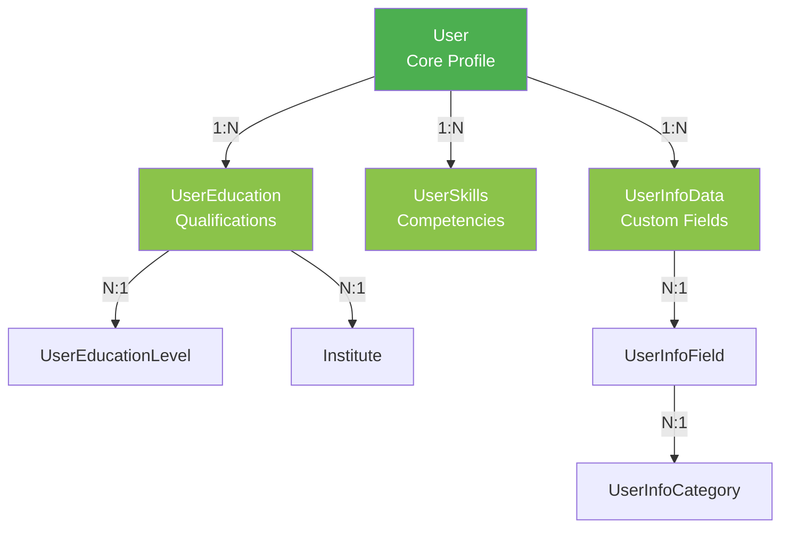
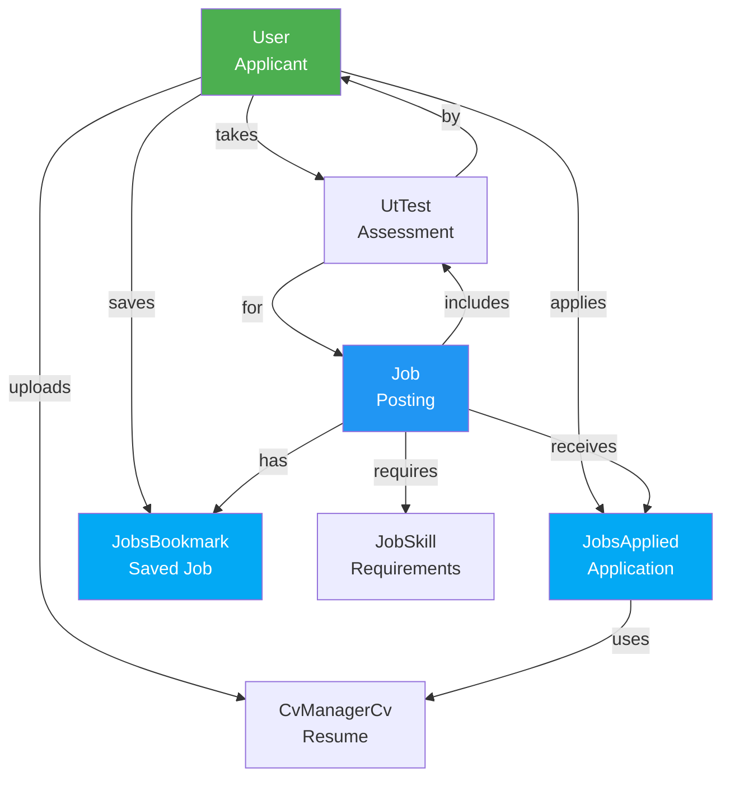
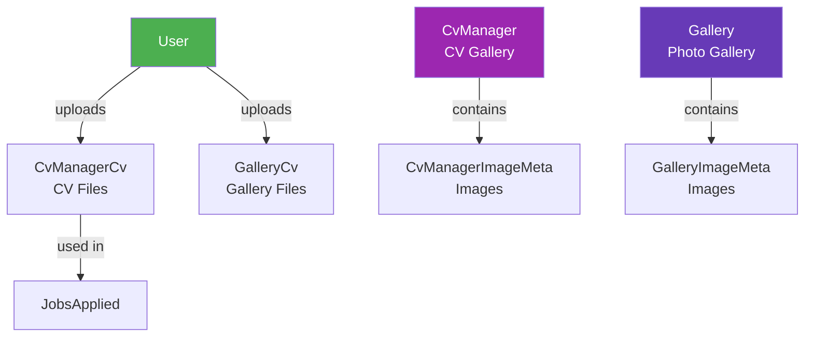
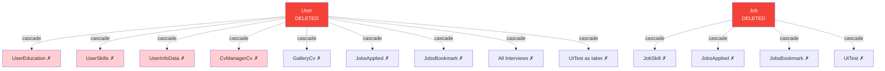
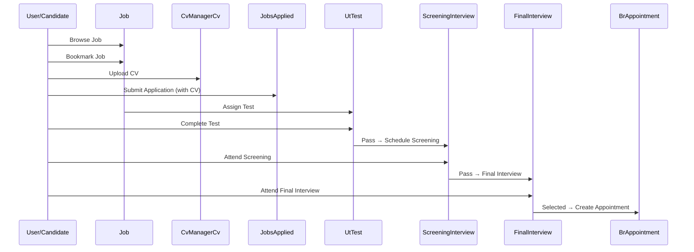
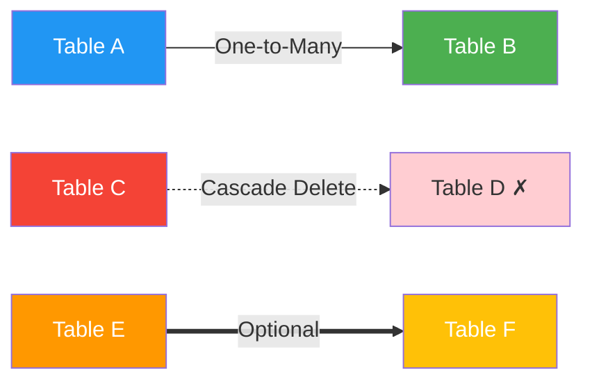

# Entity Relationship Diagram
## Recruitment Management System

This document contains visual diagrams representing the database structure.

---

## Complete ER Diagram (Mermaid)

You can view this diagram by:
1. Copying the code block to [Mermaid Live Editor](https://mermaid.live/)
2. Viewing in VS Code with Mermaid extension
3. Viewing in GitHub (supports Mermaid natively)

```mermaid
erDiagram
    %% ========================================
    %% USER MANAGEMENT MODULE
    %% ========================================
    
    User ||--o{ UserEducation : "has"
    User ||--o{ UserSkills : "has"
    User ||--o{ UserInfoData : "has"
    User ||--o{ CvManagerCv : "uploads"
    User ||--o{ GalleryCv : "uploads"
    User ||--o{ JobsApplied : "applies to"
    User ||--o{ JobsBookmark : "bookmarks"
    User ||--o{ BrAppointment : "receives"
    User ||--o{ ScreeningInterview : "attends"
    User ||--o{ FocusGroupInterview : "attends"
    User ||--o{ FinalInterview : "attends"
    User ||--o{ LetterOfIntent : "receives"
    User ||--o{ UtTest : "takes"
    User ||--o{ Job : "creates"
    
    UserEducation }o--|| UserEducationLevel : "references"
    UserEducation }o--o| Institute : "at"
    
    UserInfoData }o--|| UserInfoField : "contains"
    UserInfoField }o--|| UserInfoCategory : "grouped by"

    %% ========================================
    %% JOBS MODULE
    %% ========================================
    
    Job ||--o{ JobSkill : "requires"
    Job ||--o{ JobsApplied : "receives"
    Job ||--o{ JobsBookmark : "has"
    Job ||--o{ UtTest : "includes"
    Job }o--o| UserEducationLevel : "requires minimum"
    
    JobsApplied }o--|| CvManagerCv : "uses"

    %% ========================================
    %% CV MANAGER MODULE
    %% ========================================
    
    CvManager ||--o{ CvManagerImageMeta : "contains"

    %% ========================================
    %% GALLERY MODULE
    %% ========================================
    
    Gallery ||--o{ GalleryImageMeta : "contains"

    %% ========================================
    %% ENTITY DEFINITIONS
    %% ========================================
    
    User {
        BigInt id PK
        String auth
        String username UK
        String password
        String firstname
        String lastname
        String email UK
        String phone1
        String phone2
        String institution
        String department
        String address
        String city
        String country
        String lang
        String theme
        String timezone
        BigInt firstAccess
        BigInt lastAccess
        BigInt lastLogin
        BigInt currentLogin
        BigInt deletedAt
        Boolean suspended
        BigInt createdAt
        BigInt updatedAt
    }

    UserEducation {
        BigInt id PK
        BigInt userId FK
        BigInt educationLevelId FK
        String degreeTitle
        String institute
        BigInt instituteId FK
        String majorSubject
        String grade
        String passingYear
        String country
        BigInt createdAt
        BigInt updatedAt
    }

    UserEducationLevel {
        BigInt id PK
        String name
    }

    UserSkills {
        BigInt id PK
        BigInt userId FK
        String skillName
        Int level
        BigInt createdAt
        BigInt updatedAt
    }

    UserInfoCategory {
        BigInt id PK
        String name
        Int sortOrder
    }

    UserInfoField {
        BigInt id PK
        String name
        String shortname
        String datatype
        String description
        BigInt categoryId FK
        Int sortOrder
        Boolean required
        Boolean visible
    }

    UserInfoData {
        BigInt id PK
        BigInt userId FK
        BigInt fieldId FK
        String data
        Int dataFormat
        BigInt createdAt
        BigInt updatedAt
    }

    Job {
        BigInt id PK
        String title
        String description
        String company
        DateTime postFrom
        DateTime postTo
        Boolean status
        String industry
        String city
        String country
        String employmentType
        String employmentShift
        BigInt minimumEducationId FK
        String minimumExperience
        String certification
        String minimumSalary
        BigInt createdBy FK
        BigInt updatedBy FK
        BigInt createdAt
        BigInt updatedAt
        BigInt deletedAt
    }

    JobSkill {
        BigInt id PK
        BigInt jobId FK
        String skillName
    }

    JobsApplied {
        BigInt id PK
        BigInt jobId FK
        BigInt userId FK
        BigInt cvId FK
        String status
        BigInt appliedAt
        BigInt statusUpdatedAt
        String note
    }

    JobsBookmark {
        BigInt id PK
        BigInt jobId FK
        BigInt userId FK
        Boolean status
        BigInt createdAt
        BigInt updatedAt
    }

    CvManager {
        BigInt id PK
        String name
        Boolean comments
        Boolean isPublic
        String intro
        BigInt createdAt
        BigInt updatedAt
    }

    CvManagerCv {
        BigInt id PK
        String filepath
        String filename
        BigInt userId FK
        String status
        BigInt deletedAt
        BigInt createdAt
        BigInt updatedAt
    }

    CvManagerImageMeta {
        BigInt id PK
        BigInt cvmanagerId FK
        String image
        String metatype
        String description
    }

    Gallery {
        BigInt id PK
        String name
        Boolean comments
        Boolean isPublic
        String intro
        BigInt createdAt
        BigInt updatedAt
    }

    GalleryCv {
        BigInt id PK
        String filepath
        String filename
        BigInt userId FK
        String status
        BigInt deletedAt
        BigInt createdAt
        BigInt updatedAt
    }

    GalleryImageMeta {
        BigInt id PK
        BigInt galleryId FK
        String image
        String metatype
        String description
    }

    BrAppointment {
        BigInt id PK
        BigInt userId FK
        BigInt batchId
        String designation
        String grade
        BigInt dateOfJoining
        String basicSalary
        String medicalAllowance
        String probationPeriod
        BigInt createdAt
        BigInt updatedAt
    }

    ScreeningInterview {
        BigInt id PK
        BigInt userId FK
        BigInt batchId
        Boolean status
        String comments
        String recommendation
        String priority
        BigInt createdAt
        BigInt updatedAt
    }

    FocusGroupInterview {
        BigInt id PK
        BigInt userId FK
        BigInt batchId
        Boolean status
        String assessorName
        BigInt createdAt
        BigInt updatedAt
    }

    FinalInterview {
        BigInt id PK
        BigInt userId FK
        BigInt batchId
        Int cmp1
        Int cmp2
        Int cmp3
        Int cmp4
        Int cmp5
        String comments
        String priority
        BigInt createdAt
        BigInt updatedAt
    }

    LetterOfIntent {
        BigInt id PK
        BigInt userId FK
        BigInt batchId
        String grade
        BigInt joiningDate
        String basicSalary
        String agreementAmount
        String servingPeriod
        BigInt createdAt
        BigInt updatedAt
    }

    UtTest {
        BigInt id PK
        BigInt jobId FK
        BigInt userId FK
        String score
        Int outOfScore
        Boolean status
        BigInt startDate
        BigInt endDate
        BigInt createdBy FK
        BigInt updatedBy FK
        BigInt createdAt
        BigInt updatedAt
    }

    Institute {
        BigInt id PK
        String name
        Boolean visible
        BigInt deletedAt
    }
```

---

## Simplified Module View

### User Management Module

### Jobs & Applications Module

### Recruitment Process Module

### Document Management Module

---

## Cascade Delete Relationships

---

## Data Flow: Job Application Process

---

## Database Schema Overview

### Tables by Module

**User Management (8 tables)**
- user
- user_education
- user_education_level
- user_skills
- user_info_category
- user_info_field
- user_info_data
- institute

**Jobs & Applications (5 tables)**
- jobs
- job_skills
- jobs_applied
- jobs_bookmark
- ut_test

**Document Management (6 tables)**
- cv_manager
- cvmanager_cv
- cvmanager_image_meta
- gallery
- gallery_cv
- gallery_image_meta

**Recruitment Process (5 tables)**
- screening_interview
- focus_group_interview
- final_interview
- letter_of_intent
- br_appointment

**Total: 28 Tables**

---

## Key Relationships Summary

| Relationship Type | Count | Examples |
|------------------|-------|----------|
| One-to-Many | 45 | User → UserEducation, Job → JobSkill |
| Self-Referencing | 6 | User creates/updates Job |
| Optional Relations | 8 | Job → minimum education level |
| Cascade Delete | 20 | User → UserEducation |
| Unique Constraints | 5 | (jobId, userId) in JobsApplied |

---

## Indexes Overview

**Primary Indexes**: All tables have auto-increment BigInt primary key

**Foreign Key Indexes**: All foreign keys are automatically indexed

**Composite Unique Indexes**:
- jobs_applied(job_id, user_id)
- jobs_bookmark(job_id, user_id)
- user_info_data(user_id, field_id)

**Performance Indexes**:
- jobs(status, deleted_at)
- user(username, email)
- All created_at, updated_at, deleted_at fields

---

## Visual Legend

**Symbols:**
- `-->` Solid line: Required relationship
- `-.->` Dotted line: Cascade delete
- `==>` Double line: Optional relationship
- `FK` Foreign Key
- `PK` Primary Key
- `UK` Unique Key
- `✗` Deleted on cascade

---

**To view these diagrams:**
1. Copy the Mermaid code blocks
2. Paste into [Mermaid Live Editor](https://mermaid.live/)
3. Or use VS Code with Mermaid Preview extension
4. GitHub also renders Mermaid diagrams natively in markdown files

---

**End of Document**

